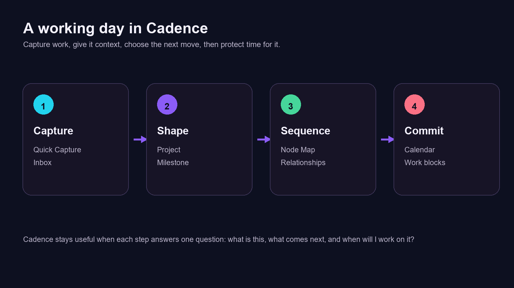
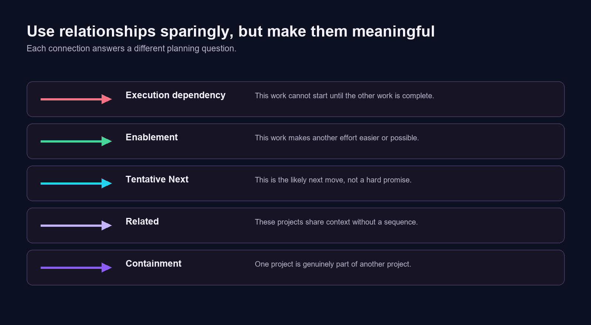
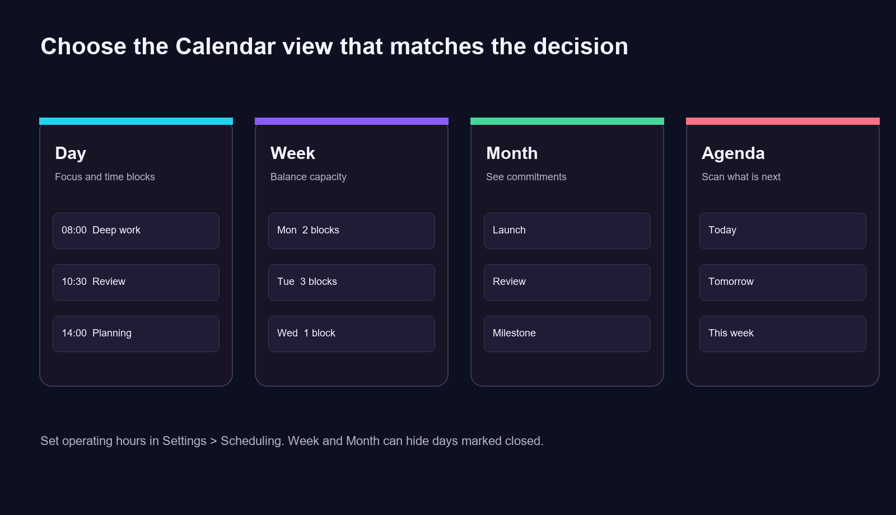

# Cadence User Guide

**Public edition**  
**Version:** 0.29.17  
**Platform:** Obsidian desktop

Cadence is a local-first planning and project-management workspace for Obsidian. It organizes work in Markdown files in your vault, then presents that work through focused views for capture, project delivery, scheduling, and strategy. Cadence does not require a cloud account. Your vault remains the source of truth.

> [!tip] Start with one real piece of work
> Do not try to configure every screen on day one. Capture one commitment, turn it into a small project, decide what comes next, and place a focused block on the Calendar. That single loop teaches the shape of Cadence.

## Contents

- [1.0 Start Here](#10-start-here)
- [2.0 Core Concepts](#20-core-concepts)
- [3.0 Navigation and Work Scopes](#30-navigation-and-work-scopes)
- [4.0 Capture, Inbox, and Today](#40-capture-inbox-and-today)
- [5.0 Projects, Milestones, and Tasks](#50-projects-milestones-and-tasks)
- [6.0 Portfolios and Parent-Child Projects](#60-portfolios-and-parent-child-projects)
- [7.0 Node Map and Relationships](#70-node-map-and-relationships)
- [8.0 Calendar and Scheduling](#80-calendar-and-scheduling)
- [9.0 Strategy, Initiatives, Timeline, and Reviews](#90-strategy-initiatives-timeline-and-reviews)
- [10.0 Settings and Customization](#100-settings-and-customization)
- [11.0 Markdown Data and Maintenance](#110-markdown-data-and-maintenance)
- [12.0 Practical Workflows](#120-practical-workflows)
- [13.0 Troubleshooting](#130-troubleshooting)

## 1.0 Start Here

### 1.1 Install

- Download `main.js`, `manifest.json`, `styles.css`, and the `assets` folder from the Cadence release.
- Create `<vault>/.obsidian/plugins/cadence-planner/`.
- Place those files and the `assets` folder in that plugin folder.
- In Obsidian, open **Settings -> Community plugins**, reload plugins, and enable **Cadence**.

Cadence is desktop-only. After enabling it, open Cadence from its ribbon action, command palette command, or configured startup behavior.

### 1.2 First-use checklist

- Open **Cadence -> Settings**.
- Confirm your daily-note folder and the headings Cadence should use for tasks and journal content.
- Set the first day of the month view and your operating hours.
- Decide whether to hide closed days in Week and Month calendar views.
- Create one project with a desired outcome, one milestone, and a small next task.
- Use Inbox for the next thing you need to remember rather than creating an unstructured note.

## 2.0 Core Concepts

### 2.1 Work scope

A work scope is a high-level lens for separating categories of work. The scope buttons in the Cadence sidebar filter eligible projects and portfolio content. A project belongs to one scope. When several scopes are selected, Cadence shows the combined set.

### 2.2 Project

A project is an outcome-oriented container for meaningful work. It can include a brief, desired outcome, status, priority, dates, notes, milestones, tasks, and relationships. Use a project when the work needs coordination, context, or multiple steps.

### 2.3 Milestone

A milestone is a durable intermediate outcome within a project. It is not simply a date. Give each milestone a clear completion condition, then attach the tasks needed to reach it. A project can have multiple milestones; task progress rolls into project progress.

### 2.4 Task, reminder, and event

- **Task:** an actionable item, normally attached to a milestone or a daily note.
- **Reminder:** a captured obligation that can have due and repeat behavior.
- **Event / work block:** a scheduled time range shown on the Calendar. Events are stored as Markdown files under Cadence's event location.

Use the smallest structure that preserves context. A one-off thought usually starts in Inbox. Work with a durable outcome belongs in a project. A commitment to a time belongs on the Calendar.

## 3.0 Navigation and Work Scopes

Cadence's main sidebar is divided into these areas:

| Area | Use it for |
| --- | --- |
| **Home** | A configurable command center and current-state overview. |
| **Plan** | Inbox, Today, and Calendar. |
| **PM** | Portfolios, Projects, and Node Map. |
| **Business Roadmap** | Strategy, Initiatives, Timeline, and Reviews. |
| **Settings** | Appearance, scheduling, startup, modules, and vault behavior. |

The work-scope buttons at the top of the sidebar act as filters. Click to include or exclude a scope. In views with a dedicated scope filter, such as Node Map, changes stay synchronized with the sidebar selection.

The sidebar can be collapsed. When **Expand collapsed sidebar on hover** is enabled in Settings, an icon-only or hidden sidebar temporarily expands under the pointer. Sidebar items provide immediate custom hover help.

### 3.1 A quick way to orient yourself

Think of the navigation as a path, not a list of unrelated pages:

- **Plan** is where incoming work and today’s decisions live.
- **PM** is where projects gain structure and relationships.
- **Business Roadmap** is where project work is connected to longer-term direction.
- **Settings** is where Cadence adapts to your schedule, vault, and preferred level of detail.

## 4.0 Capture, Inbox, and Today

### 4.1 Quick Capture

Use **Quick Capture** for ideas, commitments, and reminders that arrive before you know where they belong. The default shortcut is **Ctrl+D** on Windows and Linux, or **Cmd+D** on macOS.

Capture can create a plain reminder or schedule an appointment/work block. Add a date, recurrence, notes, and a project link when known. If you do not know the project yet, capture first and decide from Inbox.

### 4.2 Inbox

Inbox is the decision surface for unprocessed captures. For each capture, decide whether to:

- complete or delete it,
- keep it as a dated reminder,
- schedule it on Calendar,
- link it to a project, or
- promote it into a project when it needs a durable outcome and multiple steps.

Avoid treating Inbox as permanent storage. Its value comes from regularly converting vague intent into an actionable next location.

### 4.3 Today

Today combines actionable daily-note tasks, reminders, due work, and scheduled items. It is the best place to decide what to do next without opening every project. Use it as a working list, not as a second project plan: update milestones and projects where the real context lives.

## 5.0 Projects, Milestones, and Tasks

### 5.1 Create a project

Open **PM -> Projects** and choose **New Project**. Begin with:

- A concise project name.
- A **Brief** explaining the context or problem.
- A **Desired Outcome** that makes completion observable.
- A status and priority.
- A first milestone and its next task.

Cadence uses statuses to communicate intent:

| Status | Meaning |
| --- | --- |
| **Active** | Work is currently in motion. |
| **Planned** | Approved or expected work that is not yet active. |
| **Backlog** | Worth retaining but not presently committed. |
| **On hold** | Intentionally paused pending a decision, capacity, or dependency. |
| **Done** | Outcome completed. |
| **Cancelled** | Work will not continue. |

Priority is a separate signal from status. Use it to distinguish urgency or importance among otherwise eligible work.

### 5.2 Organize milestones

Create milestones for outcomes that materially reduce uncertainty or move the project forward. Good milestones are named as results, for example, `Content structure approved` or `Pilot workflow validated`, rather than as vague activity.

Within a milestone:

- add tasks in the order that makes execution clear,
- keep task wording actionable,
- use notes for decisions, constraints, and supporting context,
- complete tasks as they are finished, and
- collapse completed milestone content when you need a quieter working view.

Cadence is intentionally milestone-first. Every project task should normally be assigned to a milestone. This prevents an invisible pool of unstructured project work.

### 5.3 Project details and progress

Select a project to work in its detail view. The view provides its summary, metadata, milestones, tasks, and notes. Project progress derives from completed work rather than a manually maintained percentage. Keep statuses current so Portfolio and Node Map views remain useful.

## 6.0 Portfolios and Parent-Child Projects

Portfolios group related projects without hiding independent work. Use a portfolio when a collection benefits from a shared context, such as a product area, department, client program, or strategic theme.

### 6.1 Organize mode

In **PM -> Portfolios**, use **Organize** to create or rename portfolios, assign their work scope, and move projects between them. Drag a project onto another portfolio to reassign it.

### 6.2 Parent and child projects

Use a **Containment** / **Part of** relationship when one project is genuinely a component of another. In portfolio cards, child projects are visually indented below their parent. This is stronger than merely grouping related work: it expresses that the parent outcome contains the child project.

Do not turn every relationship into containment. Two projects can be related, sequenced, or dependent without one being a child of the other.

## 7.0 Node Map and Relationships

**PM -> Node Map** is a canvas-like workspace for relationships between projects. It is designed for understanding execution flow, not replacing project details.

### 7.1 Relationship types

| Type | Use when |
| --- | --- |
| **Execution dependency** | One item cannot proceed until another is complete. This is the hard-blocker relationship. |
| **Enablement** | One item makes another easier or more valuable without being a strict prerequisite. |
| **Tentative Next** | You expect one item to be the next useful follow-on after another. It is a planning signal, not a hard rule. |
| **Related** | The items share context but do not imply sequence or blocking. |
| **Containment** | The target is part of, or a child of, the parent project. |

### 7.2 Create and edit connections

- Open Node Map and select the scopes you want to view.
- Drag project cards to arrange the map. Use middle-click drag to pan and left-drag empty space to select multiple items.
- Drag from a project edge handle to another project to create a connection.
- Select the new or existing arrow to choose its relationship type.
- Select an arrow and use Delete/Backspace or the delete control to remove it.

### 7.3 Groups and layout tools

Create groups to organize related projects spatially. Moving a group moves its members. Containment can point to a child-project group rather than every child individually.

Use the map controls for snap-to-grid, alignment, distribution, filters, and layout cleanup. The right inspector shows the selected project's brief and desired outcome, which helps you make relationship decisions without opening each project.

## 8.0 Calendar and Scheduling

Cadence Calendar supports Day, Week, Month, and Agenda views. It displays appointments, work blocks, scheduled work, reminders, and deadlines as appropriate to the active filters.

### 8.1 Scheduling basics

- Choose **New** to create an appointment or work block.
- Drag on a time grid to create a scheduled range.
- Drag an event to move it. Hold Ctrl/Cmd while dragging to duplicate where supported.
- Drag an event's start or end handle to resize it.
- Right-click an event to edit, duplicate, delete, open a linked project, or mark it complete/incomplete.

When events overlap, Cadence displays those overlapping events side by side. Events that do not overlap use the full width of the day column.

### 8.2 Calendar views

| View | Best for |
| --- | --- |
| **Day** | Detailed time blocking and rescheduling. |
| **Week** | Balancing commitments and focus time across the working week. |
| **Month** | Scanning dates, deadlines, and all-day work. |
| **Agenda** | Reviewing upcoming work in chronological order. |

The calendar header remains visible while calendar content scrolls. When horizontal space is constrained, totals move below the date and controls retain a stable position.

### 8.3 Operating hours and closed days

In **Settings -> Scheduling**, enable each open day and set independent start/end times. Calendar time grids show closed periods, and the current day pattern is reused by roadmap scheduling. Enable **Hide closed days in Calendar** to omit closed days from Week and Month views. Day and Agenda remain available for any date.

## 9.0 Strategy, Initiatives, Timeline, and Reviews

The Business Roadmap area adds strategic context above individual projects.

- **Strategy** presents governing purpose, outcomes, capacity, and strategic direction.
- **Initiatives** tracks strategic initiatives and their current state.
- **Timeline** visualizes strategic timing, phases, and gates.
- **Reviews** supports weekly, monthly, and quarterly reflection.

Use this area when you need to decide whether the project portfolio is moving the larger plan forward. Keep operational task detail inside projects; use roadmap entries for durable strategic commitments and review decisions.

## 10.0 Settings and Customization

### 10.1 Appearance

- **Cadence dark mode:** changes Cadence surfaces without changing your global Obsidian theme.
- **Custom Cadence background image:** accepts a vault-relative path, HTTPS URL, `file:///` URL, or absolute Windows path. Leave blank to use the included background.
- **Set to default:** removes your override and restores the included background.
- **Root view background color:** applies a CSS color to the Cadence tab surface.
- **Icon gallery:** browse Lucide/Cadence icons and click one to copy its icon ID.

### 10.2 Modules

Planner and PM are the core public workflow. CRM and partner-management modules are optional. Disable modules you do not use to simplify navigation and related dashboards.

### 10.3 App behavior

Choose whether Cadence opens at Obsidian startup, opens in a pop-out window, and remembers its pop-out position. Set the default Cadence tab to the surface you use most often.

### 10.4 Daily notes and reminders

Set the daily-note folder, task heading, and journal heading to match your vault. Cadence uses these values when it reads and writes daily-note tasks. Desktop notification permission and completed-reminder cleanup are also configured here.

## 11.0 Markdown Data and Maintenance

Cadence writes its data into your vault. You can inspect and edit the resulting Markdown, but use Cadence's UI for structural changes when possible so related metadata remains consistent.

### 11.1 Data ownership

- Projects, milestones, tasks, notes, and events are Markdown-backed.
- Local UI preferences are stored by Obsidian in the plugin's local data.
- No cloud account is required for the core public workflow.

### 11.2 Safe manual-editing practices

- Keep frontmatter keys intact when editing a Cadence-managed note.
- Make small changes and reopen the Cadence view to confirm the result.
- Use normal Obsidian backlinks, links, and search freely.
- Back up your vault before bulk edits or migrations.
- Do not commit `data.json`, credentials, or personal vault content when contributing to the plugin repository.

## 12.0 Practical Workflows

### 12.1 Weekly planning

- Empty Inbox into reminders, projects, or scheduled blocks.
- Review Today for due work and open tasks.
- Check the Calendar for actual capacity.
- Open Node Map and look for hard dependencies, blocked items, and tentative next steps.
- Choose a small set of active milestones, not every project.

### 12.2 Starting a new initiative

- Create the project and state its desired outcome.
- Add the first milestone and the next concrete task.
- Put it in the appropriate portfolio and work scope.
- Add a relationship only when it changes how you will sequence or prioritize the work.
- Create a calendar block if the work needs protected time.

### 12.3 Finishing a project

- Complete remaining tasks and milestone outcomes.
- Record the result and any decisions in project notes.
- Mark the project Done or Cancelled.
- Update downstream dependencies or tentative-next relationships.
- Use a Review to capture what should change next time.

## 13.0 Troubleshooting

### 13.1 Cadence does not appear after an update

Reload community plugins or restart Obsidian. Confirm `main.js`, `manifest.json`, `styles.css`, and `assets` are all present in the plugin directory.

### 13.2 Calendar does not show expected tasks or events

Check the current Calendar filters, work scopes, date range, and whether the item has a scheduled time. For Week/Month views, check whether **Hide closed days in Calendar** is hiding the relevant day.

### 13.3 Background image does not load

Prefer a vault-relative path such as `00_Attachments/Cadence/background.png`. Confirm the attachment exists and use **Set to default** to return to the bundled background if needed.

### 13.4 A relationship or group is not visible in Node Map

Confirm that both projects are inside the selected work scopes and that the map's state/link filters include the relationship. Pan or use the map controls to locate moved cards and groups.

### 13.5 I need help or want to contribute

Use the project's GitHub issues for reproducible bugs and focused feature requests. Include your Cadence version, Obsidian version, operating system, steps to reproduce, and screenshots that do not expose private vault data.

---

Cadence is most effective when it reduces uncertainty about the next useful action. Keep the system lightweight: capture quickly, structure only what needs structure, and use relationships and schedules where they make real decisions easier.
